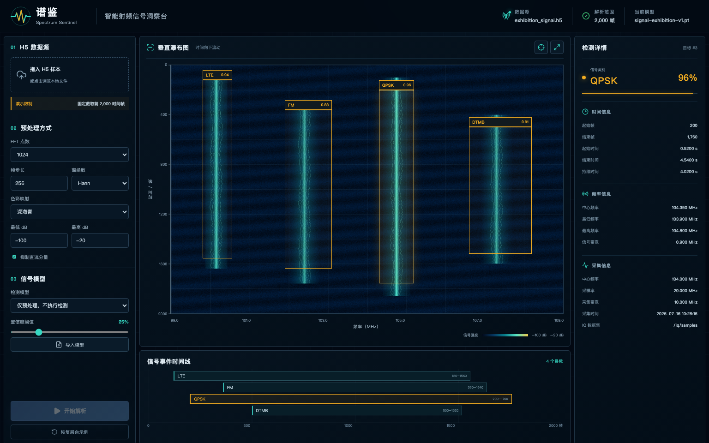

# 谱鉴 · Spectrum Sentinel

谱鉴是一套面向产品展示的智能射频信号洞察台。它通过浏览器导入 H5/HDF5 IQ 样本，按可调预处理参数生成**纵向瀑布图**，调用已有信号检测模型，并把类别、置信度、检测框、时间范围和频率范围放在同一界面展示。



## 当前 Demo 范围

- 每个 H5 文件只处理前 **2,000 个时间帧**；这是当前演示版本的明确限制。
- 瀑布图横轴为频率，纵轴为时间/帧，时间从上向下流动。
- 支持手动拖入 `.h5` / `.hdf5` 文件。
- 支持 FFT 点数、帧步长、窗函数、色图、动态范围和直流抑制参数。
- 自动扫描根目录 `models/`，也可在页面导入 `.pt`、`.onnx`、`.engine`、`.torchscript` 模型。
- 自动识别常见 H5 IQ 结构：复数数组、compound real/imag 或 I/Q、双列 I/Q、交织浮点 I/Q。
- 自动读取采样率、中心频率、带宽和采集时间等常见属性/标量数据集。
- 未选择模型时仅生成瀑布图，不伪造检测结果。初次打开显示的展台示例仅用于说明交互效果。

## 架构

- 前端：React + TypeScript + Vite
- 服务端：FastAPI
- 信号处理：NumPy + h5py
- 推理：Ultralytics（兼容 YOLO 系列和 RT-DETR 权重；产品界面不显示底层算法名称）
- 部署：Linux 一键脚本或 Docker Compose

浏览器只负责上传、参数交互和可视化；H5 解析、频谱生成与推理都在服务端完成，适合局域网演示、展厅大屏和后续集中部署。

## Linux 启动

需要 Python 3.10+ 和 Node.js 20+。首次运行会安装依赖并构建前端：

```bash
chmod +x run_linux.sh
./run_linux.sh
```

打开 `http://服务器IP:8000`。把训练得到的 `best.pt` 等模型放到 `models/` 后刷新页面即可自动发现。

开发模式：

```bash
python3 -m venv .venv
source .venv/bin/activate
pip install -r requirements-dev.txt
npm --prefix frontend install
npm --prefix frontend run dev
uvicorn spectrum_sentinel.app:app --app-dir backend --reload
```

## Docker 启动

```bash
docker compose up --build
```

`models/` 会作为持久目录挂载到容器中。

## H5 元数据与坐标换算

服务会尝试读取以下同义字段（大小写和下划线差异会自动兼容）：

- `sample_rate_hz` / `sampleRate` / `sampling_rate`
- `center_frequency_hz` / `centerFreq` / `frequency`
- `bandwidth_hz` / `bandwidth` / `span`
- `start_time` / `timestamp` / `acquisition_time`

模型框的横坐标映射为低频到高频，纵坐标映射为第 0 帧到实际处理帧数；因此右侧频率和时间值来自 H5 元数据与检测框的联合计算，而不是界面模拟值。

## 测试与构建

```bash
pytest
ruff check backend
npm --prefix frontend run build
```

## 许可证

[MIT](LICENSE)
